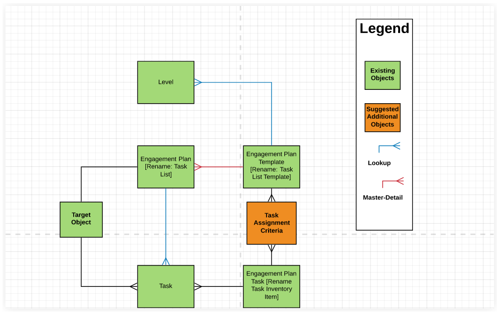
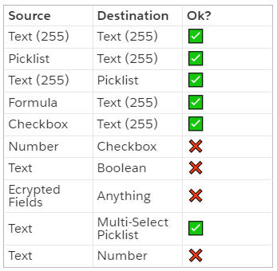
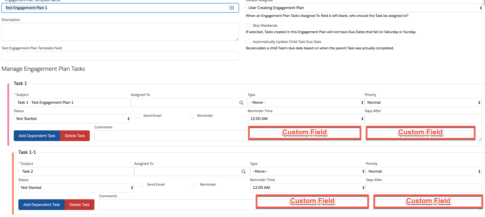

# Engagement Plans 2.0 - Overview
## Project Team
* Team Leader(s):	Annette Pretorius
* GitHub Scribe(s): Viv Yeung, Allison Letts, Greer Zimmerman
* List of all Contributors:	Michael Beaty, John Brandolini, Justin Gilmore

## Project Vision
We envision a feature set for Engagement Plans that allows for more flexibility and less data duplication. We specifically want to focus on assigning individual tasks to the parent object using criteria, and mapping custom fields onto engagement plan tasks.

# Feature Details/Specifications
## 1. Use Case Scenarios: Create documentation around ways to use engagement plans that are Service Cloud related

### Use Case - Community Foundation

In my role as a community foundation program officer, I want my grantees to receive reminders and scheduled office hours appointments about when their requirements are due so that they are proactively engaged and meeting their deadlines.
 
In my role as a community foundation program officer, I want to have reminders to invite my grantees to my open office hours so that I can answer their questions and be responsive to their needs. 

#### EP Plan Template: 2019 Awarded Grantee 
##### EP Task: 

1. Scheduled Office Hours for Quarter 1
    1. Grantee to Submit Questions
    2. Follow Up With Grantee
2. Begin report and complete first three sections for Mid Year Report at end of Quarter 2
    1. Send report to Grantee’s Senior Leader for their approval
    2. Review grantee reports and approve responses
3. Scheduled Office Hours for Quarter 3
    1. Grantee to Submit Questions
    2. Follow Up With Grantee
4. Begin report and complete first three sections for Year End Report at end of Quarter 4
    1. Send report to Grantee’s Senior Leader for their approval
    2. Review grantee reports and approve responses

##### EP Task Assignment:

* If “Arts and Culture” grant program Office Hours is an optional task, It should be created but the name and fields should be slightly different.
* Depending on grant Program assign different Program Officer 
* If Grant amount is less than $25,000, mid year report should not be assigned
* If “Basic Needs” grant program Senior Leader is not required

### Use Case - Direct Service Org

In my role as a Program Intake Coordinator 
I want to after I determine which programs a person is eligible for set up tasks for other programs to follow up and take their next steps
So that the person can get the services they need to stabilize their life 

### Use Case - Partner Help Desk

In my role as an IT Support Coordinator
I want to send and confirm scheduled appointment dates and ensure that follow-up messages are sent and survey requests are 
So that the clients feel supported and to ensure that their IT requests are full-filled and their feedback is solicited when the support case is complete

### Use Case - Teachers

In my role as a teacher
I want to assign tasks to parents/guardians of students 
So that to ensure that parents/guardians are aware of upcoming meetings, professional development days and milestones for their children 

### Use Case - Fundraisers 

Clearly this isn’t Service Cloud, but task assignment criteria are important to roles and orgs across the ecosystem.
In my role as a fundraising director,
I want to assign tasks to a range of people related to the opportunity or account
So that the users who would be involved in a solicitation are assigned automatically.

#### EP Plan Template/Task List Template: Major Gift Solicitation
##### EP Task Inventory

* Assign Primary Solicitor
* Make phone call to donor
* Send thank you letter
* Review wealth screening

##### EP Task Assignment Criteria

* If P2G score > 3 && Solicitor isblank, create task to assign primary solicitor via PB
* If P2G score > 3 && Solicitor not(isblank), make phone call to donor Solicitor__c
* If Owner.IsActive == true, send thank you letter Owner
* If Owner.Isactive == false, send thank you letter Solicitor__c

## 2.  Updated ERD

## 3. Task Criteria: Allow for conditional logic for engagement plan tasks

Example: for a single engagement plan template, after the first task, of the contact lives in New York trigger a for a user to call the user. If the contact does not live in New York, create a task to email them. 

Ability to:

* Allow a user to define when a Task Inventory Item should be added to Task List Template based on values on the Target Object.

Use Cases:

* Users don’t have to create entirely new Task List Templates for small variations in the Tasks that should be assigned. For example, suppose an organization segments their donors into 5 different groups based on their state. Regardless of what segment a donor is in, the same 6 actions need to be executed, but depending on their segment the 6th action is slightly different. This functionality would allow them to create 1 Task List that adds the right variations for the 6th task based on the donor’s segment.
* If a Contact has been marked as Do Not Call, if a Task List Template contains a Phone Call activity, that activity will be skipped if that template is assigned to that Contact (and might instead include the same content sent by email).

*SOLUTION:*
Refer to the ERD in #2 above

Create a copy of the Engagement Plans Package with the following objects and modify as follows:

1. Rename Engagement Plan Template to Task List Template
2. Rename Engagement Plan Task to Task Inventory Item
3. Create a new Junction Object called Task Assignment Criteria that links Task Inventory Item to Task List Template

_Overview of the Task Assignment Criteria object_
The purpose of this object is three-fold:

1. Allow one task to be assigned to multiple Task List Templates (for example, a task to send a thank-you letter could be repeated for Task List Templates for many different donor levels)
2. Allow for custom logic that decides if the Task Inventory Item should be copied to the Task List that gets attached to the destination object. (if donation amount is greater than $500, create a task to call the donor)
3. Provide an opportunity to dynamically assign the Task Owner (use the User linked in this field on the Account) and the Related To record

_Fields on the Task List Template_

1. *Target Object*: A metadata lookup field to Objects that lets the user indicate what Object this Task List Template is going to be used for

_Fields to Add to Task Object_

1. *Task_List_Template__c*: A lookup to Task List Template object
2. *Task_Assignment_Criteria__c*: A lookup to Task_Assignment_Criteria object. This could be used to help with debugging task assignment criteria.

_Fields on the Task Assignment Criteria object_

1. *Target Object:*  A metadata lookup field to Objects that lets the user indicate what Object this Task Assignment Criteria record is relevant to
2. *Task OwnerID*: A metadata lookup field that lets you reference a User Lookup Field on the Target Object that will determine who the AssignedTo User will be on the Task
3. *Task WhatID*: A metadata lookup field that lets you reference the record that this task should be assignment to. We envision a Process Builder type interface that would let you traverse through lookup fields (ex. If the Task_List_Template.Target_Object is Payment, then you could go Payment→Opportunity→Primary_Contact to create the task for the related Opportunity Primary Contact.
4. *Criteria*: A text field that allows the user to write a SOQL expression which will determine when the Task Inventory Item should create a Task whenever the Task List Template is assigned to an Object. It would be idea if this feature could have a Workflow Rule interface where the user can select fields 
5. *Task List Template*: Lookup to Task List Template object.
6. *Task Inventory Item:* Lookup to the Task Inventory Item object.

LOGIC

1. Whenever a new Task Assignment Criteria record is created, the Task_Assignment_Criteria.Target_Object should be inherited from Task_Assignment_Criteria.Task_List_Template.Target_Object
2. Task_Assignment_Criteria.Task_Inventory_Item cannot be populated with a Task_Inventory_Item that is dependent on another task (We cannot create criteria for dependent tasks)
3. Whenever a new Task Assignment Criteria record is saved, the SOQL expression should be validated to make sure that it can be evaluated from the Target Object.
4. Whenever a new Task List is created (connecting a Record to a Task List Template)
    1. Pull up all *Task Assignment Criteria* records where *Task List Template* = Task_List__c.Task_List_Template__c 
    2. For each Task Assignment Criteria record found, evaluate the SOQL expression in Task_Assignment_Criteria.Criteria. 
        1. If Task_Assignment_Criteria.Criteria = False, skip this Task Assignment Criteria record and go to the next one.
        2. If Task_Assignment_Criteria.Criteria = True, pull up the related Task_Inventory_Item record linked through Task_Assignment_Criteria create a new Task record where:
            1. Related To = Task_Assignment_Criteria.Task_WhatID
            2. Assigned To = Task_Assignment_Criteria.Task_OwnerID
            3. Task_List_Template = Task_Assignment_Criteria.Task_List_Template
            4. Task_Assignment_Criteria = Task_Assignment_Criteria.ID (the Task Assignment Criteria record that triggered the creation of the Task)
            5. Status = Task_Inventory_Item.Status
            6. All other Tasks fields are populated using the values on Task Inventory Item and according to the existing logic around creating Tasks from Engagement Plan Tasks
    3. If the Task Inventory Item being copied has dependent tasks, all dependent tasks should also be copied

## 4.  Custom Field Mapping: Allow for mapping from Engagement Plan Task to SF Task for custom fields 
[This feature is a pull request on the Cumulus repo.](https://github.com/SalesforceFoundation/Cumulus/pull/4708) 

Ability to:

* Allow a user to create additional fields that can be added to Engagement Plan Tasks
* These fields would map to the subsequent Task records that are created on Engagement Plan assignment

So that:

* Users can have additional information, relevant to their organization, tracked to their subsequent tasks
* Management of custom fields on Engagement Plan Templates is easy to manage

Issues to address:

* The fields that are referenced in Tasks within the Engagement Plan Template, are pulled through a defined reference in a VisualForce page npsp__EP_ManageEPTemplate 
* EP_TaskUtil.cls in the CreateTasks where it is located which would need to be edited to include the custom fields

What will be worked on:

* If a Custom Field is added to the Engagement Plan Task Object, it can be manually added to the Engagement Plan Task record *NOT* VisualForce page npsp__EP_ManageEPTemplate. 
* It will be designed to map a custom field named exactly the same, to the custom field on the Task Object, and will be based on API Name, not label

### Testing Data

* Create fields between Engagement Plan Tasks and Tasks that match based on API name:
    * Match
     * Engagement Plan Task field (Text 255)- Test_Text_Field_Match
     * Task field (Text 255)- Test_Text_Field_Match
    * Don’t Match
     * Engagement Plan Task field (Text 255) - Text_Number_Field_to_Number
     * Task field (Number 16,2) - Text_Number_Field_to_Number
    * Formula fields on the Task that match
     * Engagement Plan Task field (Formula) - Formula_Task_Field_Match
      * Task field (Text) - Formula_Task_Field_Match
    * AutoNumber
     * Engagement Plan Task field (Auto Number) - Auto_Number_to_Text_Field
     * Task field (Text 255) - Auto_Number_to_Text_Field
    * Same API name, different types of fields (Currency > Date)
     * Engagement Plan Task field (Currency) - Currency_to_Date_field_Mapping
     * Currency_to_Date_field_Mapping (Date) - Currency_to_Date_field_Mapping
    * Standalone Fields with no Mapping and Different API names
     * Engagement Plan Task field (Text 255) - Standalone_Engagement_Plan_Task
     * Task field (Text 255) - Standalone_Field_Task

### Mapping

Engagement Plan Task to Task - Source Fields need to match the Target fields API Names and Field Type. However, there are exceptions and most fields at the Source, can map to the Target if the Target field on Tasks is Text.

## 5. Custom Task Fields: Add custom fields to Engagement Plan Setup Page

how to:

* Custom Fields can be added to Engagement Plans through the Field Set npsp__ManageEPTemplateFS.
    * This will add fields to the actual Engagement Plan Template record, and can display it on the VisualForce Page

issues to Note:

* Formatting of the VisualForce page will be limited, as the field set is pre-referenced in the code, adding too many fields may offset and create issues with formatting

## 6. Allow option to delete or close tasks associated with previous engagement plan when a new one is added

Ability to:

* Mark a Task List as completed or cancelled and have it update all tasks associated with that Task List

So that:

* If a series of tasks is no longer relevant, or were completed in bulk, the user can quickly close all the related open tasks

*USE CASE:*

* A volunteer reaches a particular achievement and a task list for a series of recognition actions is created. A few days after the Task List is assigned, the volunteer resigns. The Volunteer Coordinator would like to quickly mark all the remaining open tasks as Cancelled.

# Future Contributions (AKA what were you unable to finish at the Sprint)

1. Other action types: In addition to tasks, allow users to set other actions (ideas were adding to a campaign, updating a field on the object)
1.  Editing Task List Template: allow a user to be able to view and edit Task Inventory Items and criteria prior to creating a Task List through the same interface as if they were creating a new template 
1. Package this code independently of NPSP to support implementation in enterprise/EDA orgs (or minimally add to the EDA feature set)

# Existing Resources 

* https://trailhead.salesforce.com/en/content/learn/modules/moves-management-with-nonprofit-success-pack/manage-engagement-plans
* http://powerofus.force.com/s/article/NPSP-Create-and-Manage-Engagement-Plans#ariaid-title12
* https://cloud4good.com/announcements/npsp-engagement-plans-levels/
* https://www.youtube.com/watch?v=rViKhzQHPBM
* https://www.slideshare.net/salesforcefoundation/making-moves-magic-a-moves-management-101-for-nonprofit-cloud

